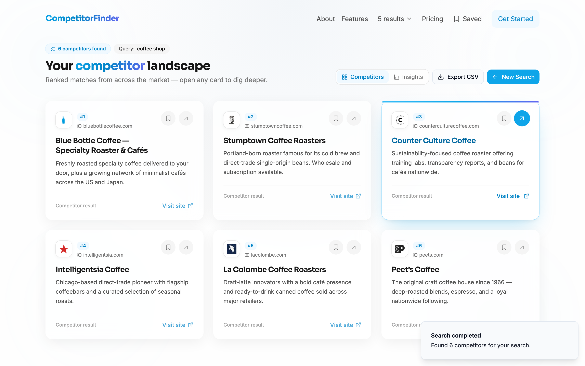
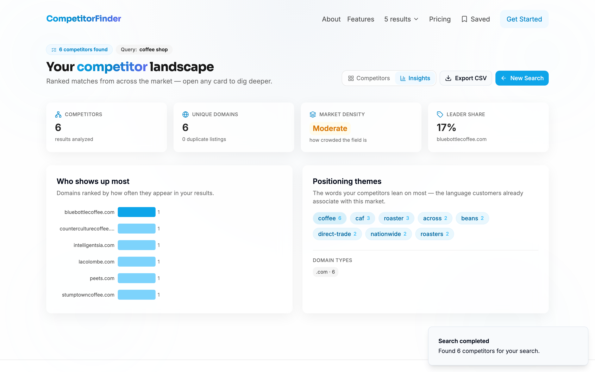
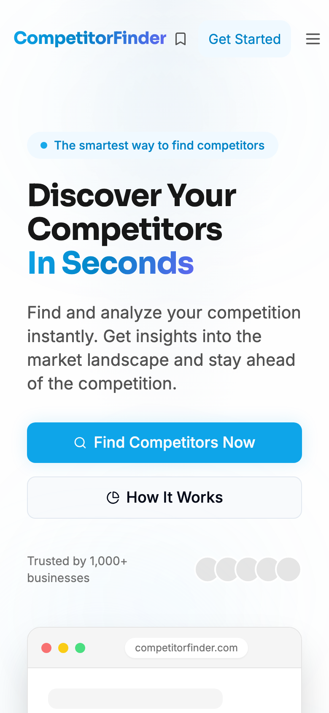
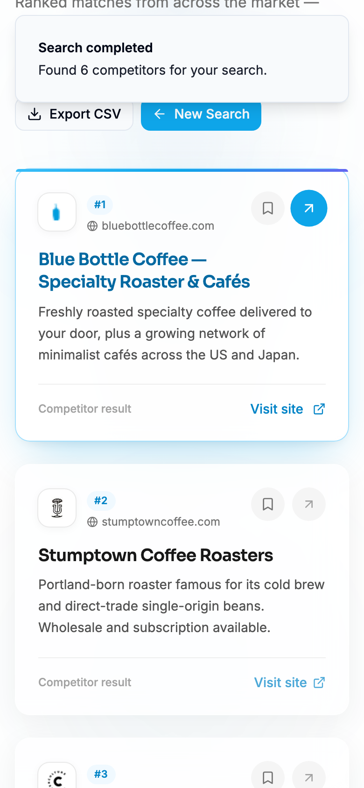

# CompetitorFinder 🔍

<p align="left">
  <a href="https://researcher.techrealm.online/"></a>
  
  
  
  
  
  
  
</p>

**Find and analyze your competition in seconds.** CompetitorFinder turns a category and a country into a tidy, ranked list of the businesses you're actually up against — then hands you a market-insights dashboard, a save-for-later shortlist, and a one-click CSV export. No spreadsheets, no guesswork, no doom-scrolling to Google page 7.

> ☕ **Latte-there be competition:** pick what you sell, pick where you sell it, hit **Find Competitors**, and watch the landscape assemble itself. It does one thing and tries to do it *delightfully*.

<p align="center">
  
</p>

<p align="center">
  <a href="https://researcher.techrealm.online/"><strong>🌐 Try the live app → researcher.techrealm.online</strong></a>
</p>

---

## ⚡ Quick start

Clone, install, and run in one line (Node 18+):

```sh
git clone https://github.com/waleedsworld/research-competitor-navigator.git && cd research-competitor-navigator && npm install && npm run dev
```

Then open the printed local URL (usually `http://localhost:8080`). Edits hot-reload instantly. A first-timer walkthrough lives [further down](#-getting-started-for-absolute-beginners).

---

## ✨ What's new in this release

This version is a substantial glow-up over the original one-page search. The headliners:

| 🆕 Feature | What you get |
|-----------|--------------|
| 📊 **Competitor Insights dashboard** | Flip results into an analytics view: market-density gauge, leader share, a "who shows up most" domain bar chart, positioning-theme keywords, and a domain-type breakdown. |
| 🔖 **Saved shortlist** | Bookmark any competitor and it sticks around — persisted to `localStorage` and surfaced in a slide-over sheet with a live count in the header. |
| 💎 **Premium result cards** | Live favicons with graceful monogram fallbacks, rank pills, hover accent bars, and buttery loading skeletons that mirror the real layout. |
| 🧪 **A/B landing variants** | Two production-ready hero designs, switchable straight from the URL (`/?variant=b`). No feature-flag service required. |
| ♿ **Accessibility + performance** | Skip-to-content link, proper landmarks, visible focus states, `prefers-reduced-motion` support, and route-level code-splitting so the landing bundle ships lean. |
| 🛡️ **Robustness** | Safe URL parsing that never crashes the grid on a malformed link, graceful empty/error states, and 44px tap targets across mobile. |
| ✅ **Real test suite** | Unit, component, and Playwright end-to-end tests wired into GitHub Actions CI. |
| 🔎 **Discoverability** | JSON-LD structured data, sitemap, web manifest, full icon set, and canonical URLs. |

## 🖼️ A look around

**Ranked competitor landscape** — premium cards with favicons, rank pills, save + visit actions, and one-click CSV export.



**Insights dashboard** — the same results, re-cut as market intelligence.



**Landing hero** (Variant A)


**Looks great on mobile, too**

<p>
  
  &nbsp;
  
</p>

## 🎯 Core features

- **Two-step onboarding** — choose a product category (Toys, Fashion, Electronics, Home, or a custom niche), then a target market from 20 countries. Simple enough to finish before your coffee cools.
- **Instant competitor search** — queries a live search backend and returns ranked competitors with title, snippet, and a one-click link out.
- **Two result modes** — flip between the **Competitors** card grid and the **Insights** analytics dashboard with a single tab.
- **Adjustable result depth** — quick peek or deep dive? Toggle 5 / 10 / 20 / 50 results from the header.
- **Save for later** — bookmark competitors into a persistent shortlist you can revisit any time.
- **CSV export** — download a spreadsheet-ready `.csv` in one click for your team or research doc.
- **Fully responsive & accessible** — collapsing header, single-column reflow, keyboard-navigable, reduced-motion friendly.

## 🧰 Built with

- [**Vite**](https://vitejs.dev/) — lightning-fast dev server and build tool
- [**React 18**](https://react.dev/) + [**TypeScript**](https://www.typescriptlang.org/) — typed, component-driven UI
- [**Tailwind CSS**](https://tailwindcss.com/) — utility-first styling with a custom brand palette
- [**shadcn/ui**](https://ui.shadcn.com/) + [**Radix UI**](https://www.radix-ui.com/) — accessible, unstyled primitives
- [**React Router**](https://reactrouter.com/) — client-side routing
- [**TanStack Query**](https://tanstack.com/query) — data fetching and caching
- [**lucide-react**](https://lucide.dev/) — crisp icon set
- [**Vitest**](https://vitest.dev/) + [**Testing Library**](https://testing-library.com/) + [**Playwright**](https://playwright.dev/) — unit, component & e2e tests

---

## 🚀 Getting started (for absolute beginners)

Never run a React project before? No worries — you'll be up and running in a few copy-paste commands.

### 1. Install the prerequisites

You only need **Node.js** (which ships with `npm`). CompetitorFinder is tested on **Node 18+**.

- **Don't have Node?** The cleanest way is [nvm](https://github.com/nvm-sh/nvm#installing-and-updating):
  ```sh
  # macOS / Linux
  curl -o- https://raw.githubusercontent.com/nvm-sh/nvm/v0.39.7/install.sh | bash
  # then restart your terminal, and:
  nvm install 18
  nvm use 18
  ```
- **On Windows?** Grab the installer from [nodejs.org](https://nodejs.org/) instead.

Check it worked:
```sh
node -v   # should print v18.x or higher
npm -v    # should print a version number
```

### 2. Clone and enter the project

```sh
git clone https://github.com/waleedsworld/research-competitor-navigator.git
cd research-competitor-navigator
```

### 3. Install dependencies

```sh
npm install
```
This pulls down everything the app needs. Grab a snack — it takes a minute the first time.

### 4. Start the dev server

```sh
npm run dev
```

You'll see a local URL (usually `http://localhost:8080`). Open it in your browser and you're live. Edits you save show up instantly thanks to Vite's hot reload. 🔥

### 5. Build for production (optional)

```sh
npm run build     # outputs an optimized bundle to dist/
npm run preview   # serves the production build locally to sanity-check it
```

---

## 🧪 Running the tests

The suite covers URL/utility logic, the search client, key components, and a full end-to-end browser flow.

```sh
npm test            # unit + component tests (Vitest, single run)
npm run test:watch  # same, in watch mode
npm run test:e2e    # Playwright end-to-end smoke flow
```

CI runs the same steps on every push via [`.github/workflows/ci.yml`](.github/workflows/ci.yml).

## ⚙️ Configuration

CompetitorFinder talks to a search backend defined in **`src/utils/api.ts`**:

```ts
const API_BASE_URL = 'https://productfinder.techrealm.online';
```

Point this at your own search API if you like — the app expects a `GET /search?query=...&location=...&limit=...` endpoint that returns:

```json
{
  "query": "electronics",
  "results": [
    { "title": "...", "link": "https://...", "snippet": "..." }
  ],
  "total_results": 42,
  "limited_results": false
}
```

## 🧫 Landing A/B variants

The landing hero ships in two flavours you can A/B test straight from the URL — no feature-flag service required:

- `/` — **Variant A** (control): two-column split with a browser mockup.
- `/?variant=b` — **Variant B** (challenger): centred gradient hero with a single CTA and a proof-stats row.

Everything below the hero is shared, so conversion is directly comparable. See [`docs/AB_VARIANTS.md`](docs/AB_VARIANTS.md) for the full breakdown and how to wire up analytics.

## 🗂️ Project structure

```
src/
├── components/          # HeroSection(+B), OnboardingForm, SearchResults,
│   │                    # CompetitorCard, CompetitorInsights, SavedCompetitorsSheet, …
│   └── ui/              # shadcn/ui primitives (button, card, dialog, …)
├── pages/               # Index (the app) and NotFound
├── hooks/               # useSavedCompetitors, useVariant, use-toast, use-mobile
├── lib/                 # url.ts (safe URL parsing), utils.ts (cn helper)
├── utils/               # api.ts (search client + data), insights.ts (analytics)
└── types/               # shared TypeScript interfaces
e2e/                     # Playwright end-to-end tests
```

## 🧭 How it works, end to end

1. You land on the hero and hit **Get Started / Find Competitors Now**.
2. **Step 1** — choose a category (or type your own).
3. **Step 2** — choose a country from the searchable list.
4. The app calls the search backend with your query, location, and desired result count.
5. Results render as premium glass cards. Flip to **Insights** for market intelligence, **save** the interesting ones, **export** to CSV, or start a fresh search.

## 📄 License

Released for personal and educational use. Fork it, learn from it, and make it your own.

---

Made with care by **Waleed Ajmal**. If CompetitorFinder saves you an afternoon of manual research, that's a win worth celebrating. Happy hunting! 🎯
