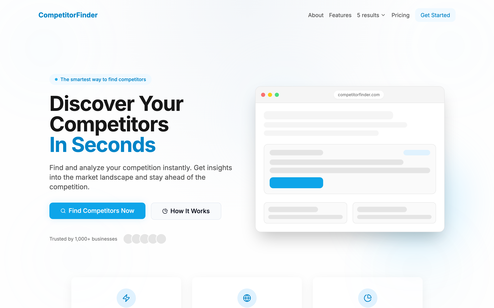
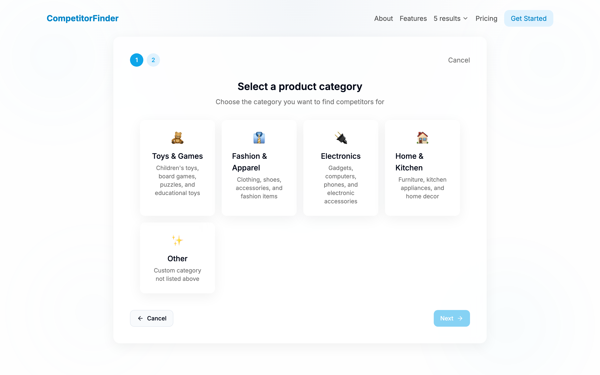
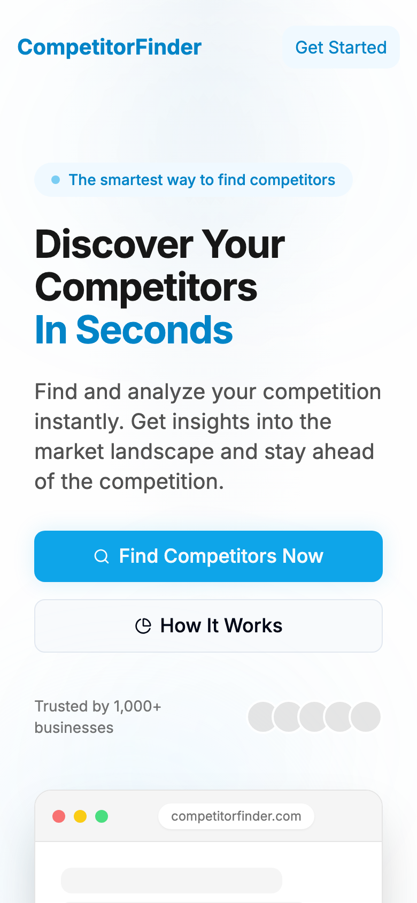

# CompetitorFinder 🔍

**Find and analyze your competition in seconds.** CompetitorFinder is a fast, friendly web app that turns a category and a country into a tidy list of the businesses you're actually up against — no spreadsheets, no guesswork, no doom-scrolling through Google page 7.

Pick what you sell, pick where you sell it, hit **Find Competitors**, and get a clean, exportable list of rivals with titles, snippets, and direct links. That's the whole pitch. It does one thing and tries to do it delightfully.

> **Live demo — deploying soon.** (This repo is fully runnable locally in under two minutes — instructions below.)

---

## ✨ What it does

- **Two-step onboarding** — choose a product category (Toys, Fashion, Electronics, Home, or your own custom niche), then a target market from 20 countries. Simple enough to finish before your coffee cools.
- **Instant competitor search** — queries a live search backend and returns ranked competitors with title, description snippet, and a one-click link out.
- **Adjustable result depth** — want a quick peek or a deep dive? Toggle between 5, 10, 20, or 50 results right from the header.
- **CSV export** — download your competitor list as a spreadsheet-ready `.csv` in one click. Great for handing off to your team or dropping into a research doc.
- **Fully responsive** — the header collapses gracefully on phones, cards reflow into a single column, and everything stays tappable.
- **Polished, animated UI** — glassmorphic cards, an animated gradient background, fade-up motion, and a design system built on shadcn/ui + Tailwind.
- **SEO-ready** — Open Graph tags, Twitter cards, canonical URLs, and per-page meta via `react-helmet-async`.

## 🖼️ A look around

**Landing / hero**



**Two-step onboarding — pick a category**



**Looks great on mobile, too**



## 🧰 Built with

- [**Vite**](https://vitejs.dev/) — lightning-fast dev server and build tool
- [**React 18**](https://react.dev/) + [**TypeScript**](https://www.typescriptlang.org/) — typed, component-driven UI
- [**Tailwind CSS**](https://tailwindcss.com/) — utility-first styling with a custom brand palette
- [**shadcn/ui**](https://ui.shadcn.com/) + [**Radix UI**](https://www.radix-ui.com/) — accessible, unstyled primitives
- [**React Router**](https://reactrouter.com/) — client-side routing
- [**TanStack Query**](https://tanstack.com/query) — data fetching and caching
- [**lucide-react**](https://lucide.dev/) — crisp icon set

---

## 🚀 Getting started (for absolute beginners)

Never run a React project before? No worries — you'll be up and running in a few copy-paste commands.

### 1. Install the prerequisites

You only need **Node.js** (which ships with `npm`). CompetitorFinder is tested on **Node 18+**.

- **Don't have Node?** The cleanest way is [nvm](https://github.com/nvm-sh/nvm#installing-and-updating):
  ```sh
  # macOS / Linux
  curl -o- https://raw.githubusercontent.com/nvm-sh/nvm/v0.39.7/install.sh | bash
  # then restart your terminal, and:
  nvm install 18
  nvm use 18
  ```
- **On Windows?** Grab the installer from [nodejs.org](https://nodejs.org/) instead.

Check it worked:
```sh
node -v   # should print v18.x or higher
npm -v    # should print a version number
```

### 2. Clone and enter the project

```sh
git clone https://github.com/waleedsworld/research-competitor-navigator.git
cd research-competitor-navigator
```

### 3. Install dependencies

```sh
npm install
```
This pulls down everything the app needs. Grab a snack — it takes a minute the first time.

### 4. Start the dev server

```sh
npm run dev
```

You'll see a local URL (usually `http://localhost:8080`). Open it in your browser and you're live. Edits you save show up instantly thanks to Vite's hot reload. 🔥

### 5. Build for production (optional)

```sh
npm run build     # outputs an optimized bundle to dist/
npm run preview   # serves the production build locally to sanity-check it
```

---

## ⚙️ Configuration

CompetitorFinder talks to a search backend defined in **`src/utils/api.ts`**:

```ts
const API_BASE_URL = 'https://productfinder.techrealm.online';
```

Point this at your own search API if you'd like — the app expects a `GET /search?query=...&location=...&limit=...` endpoint that returns:

```json
{
  "query": "electronics",
  "results": [
    { "title": "...", "link": "https://...", "snippet": "..." }
  ],
  "total_results": 42,
  "limited_results": false
}
```

## 🗂️ Project structure

```
src/
├── components/          # HeroSection, OnboardingForm, SearchResults, CompetitorCard, …
│   └── ui/              # shadcn/ui primitives (button, card, dialog, …)
├── pages/               # Index (the app) and NotFound
├── utils/api.ts         # search client + category/location data
├── types/               # shared TypeScript interfaces
├── hooks/               # use-toast, use-mobile
└── lib/utils.ts         # cn() class-merge helper
```

## 🧭 How it works, end to end

1. You land on the hero and hit **Get Started / Find Competitors Now**.
2. **Step 1** — choose a category (or type your own custom one).
3. **Step 2** — choose a country from the searchable list.
4. The app calls the search backend with your query, location, and desired result count.
5. Results render as glass cards. Export them to CSV, tweak the count, or start a fresh search.

## 📄 License

Released for personal and educational use. Feel free to fork it, learn from it, and make it your own.

---

Made with care by **Waleed Ajmal**. If CompetitorFinder saves you an afternoon of manual research, that's a win worth celebrating. Happy hunting! 🎯
